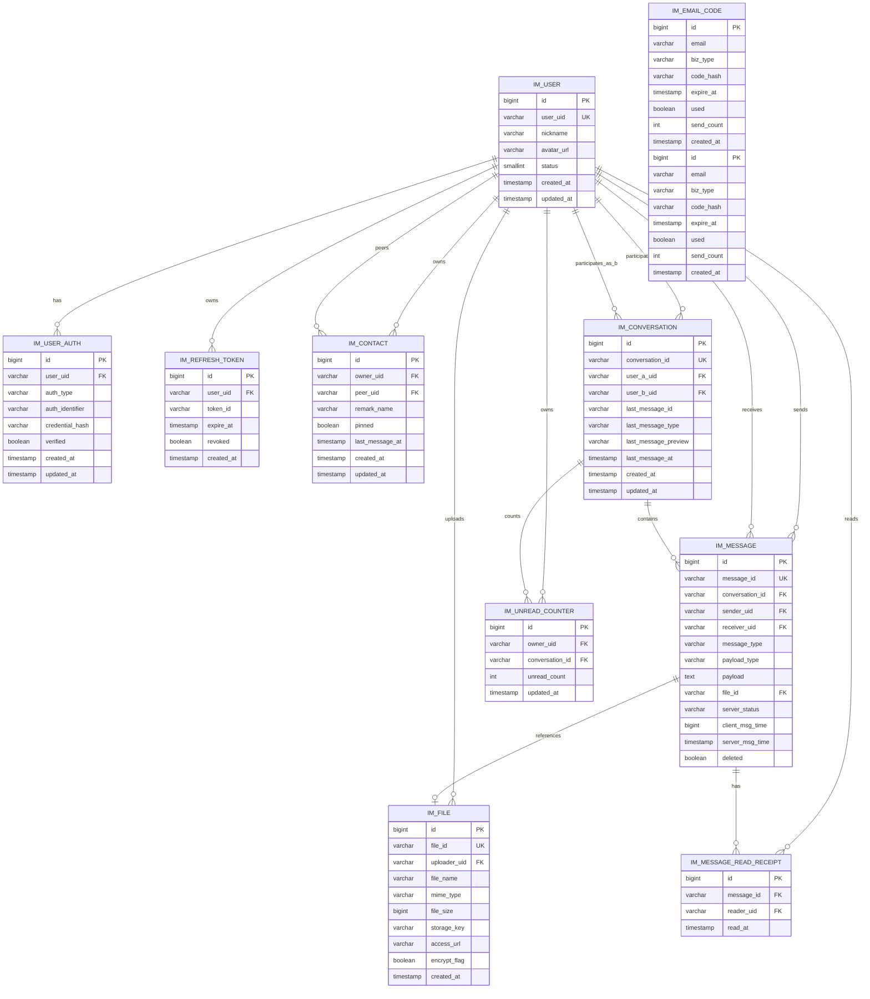
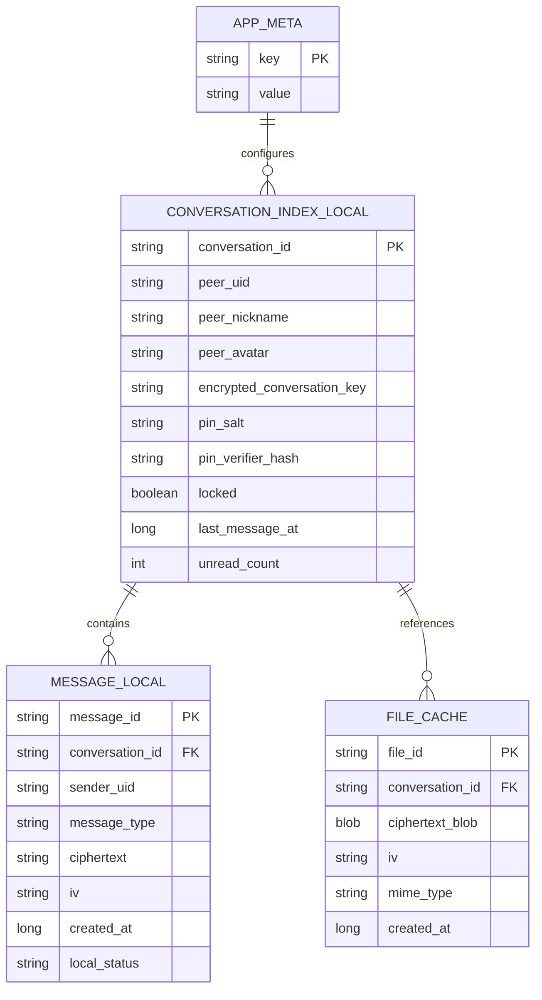

# 《数据库字段设计文档 v1.0》

**适用范围：**

* 后端：Spring Boot + PostgreSQL
* 前端：Web 浏览器本地持久化（IndexedDB）
* 场景：1V1 聊天、邮箱登录、幸运数字伪装入口、PIN 解锁本地历史消息

---

# 1. 文档目标

本文档定义本系统的：

* 后端数据模型
* 前端本地数据模型
* ER 图
* 字段设计
* 字段类型建议
* 主键、唯一约束、索引建议
* 设计说明与边界

---

# 2. 设计原则

## 2.1 后端与前端数据职责分离

后端负责：

* 用户账号
* 认证凭证
* 联系人关系
* 会话索引
* 消息中转与存档
* 文件元数据
* 未读计数
* 验证码与 token

前端负责：

* 幸运数字 hash
* PIN 校验材料
* 会话密钥密文
* 本地消息密文缓存
* 本地图片密文缓存
* 锁定状态

---

## 2.2 核心边界

以下数据**不放后端数据库**：

* 幸运数字明文
* PIN 明文
* conversationKey 明文
* 本地历史明文消息

---

## 2.3 数据库选型建议

后端推荐：

* PostgreSQL 15+

前端推荐：

* IndexedDB

---

# 3. 命名规范

## 3.1 表命名

统一前缀：

* `im_`：即时通讯后端表
* 前端 IndexedDB object store 不强制加前缀

## 3.2 字段命名

统一使用：

* 小写下划线风格
* 时间字段统一：

  * `created_at`
  * `updated_at`

## 3.3 主键策略

每张后端表都建议同时具备：

* 数据库主键：`id bigint`
* 业务唯一标识：如 `user_uid`、`conversation_id`、`message_id`

原因：

* 数据库内部 join 和索引更稳定
* 对外暴露业务 ID 更安全

---

# 4. 后端 ER 图

---

# 5. 前端本地 ER 图

---

# 6. 后端表设计

---

# 6.1 用户主表 `im_user`

## 6.1.1 表用途

存放用户的主体业务信息，不与具体登录方式强绑定。

## 6.1.2 字段设计

| 字段名        | 类型推荐         | 非空 | 默认值   | 说明         |
| ---------- | ------------ | -: | ----- | ---------- |
| id         | bigint       |  是 | 自增/雪花 | 数据库主键      |
| user_uid   | varchar(64)  |  是 | -     | 用户业务唯一 ID  |
| nickname   | varchar(64)  |  是 | -     | 用户昵称       |
| avatar_url | varchar(255) |  否 | null  | 头像地址       |
| status     | smallint     |  是 | 1     | 状态：1正常 0禁用 |
| created_at | timestamp    |  是 | now() | 创建时间       |
| updated_at | timestamp    |  是 | now() | 更新时间       |

## 6.1.3 约束建议

* 主键：`pk_im_user(id)`
* 唯一约束：`uk_im_user_user_uid(user_uid)`

## 6.1.4 索引建议

* 唯一索引：`user_uid`
* 普通索引：`status`

## 6.1.5 字段补充建议

昵称不是登录标识，不建议唯一。

---

# 6.2 用户认证表 `im_user_auth`

## 6.2.1 表用途

支持多登录方式统一绑定到同一个用户。

## 6.2.2 字段设计

| 字段名             | 类型推荐         | 非空 | 默认值   | 说明                                        |
| --------------- | ------------ | -: | ----- | ----------------------------------------- |
| id              | bigint       |  是 | 自增/雪花 | 主键                                        |
| user_uid        | varchar(64)  |  是 | -     | 关联用户 UID                                  |
| auth_type       | varchar(32)  |  是 | -     | 登录类型：email_password / email_code / wechat |
| auth_identifier | varchar(128) |  是 | -     | 邮箱/openid 等                               |
| credential_hash | varchar(255) |  否 | null  | 密码 hash，验证码登录可为空                          |
| verified        | boolean      |  是 | false | 是否已验证                                     |
| created_at      | timestamp    |  是 | now() | 创建时间                                      |
| updated_at      | timestamp    |  是 | now() | 更新时间                                      |

## 6.2.3 约束建议

* 主键：`pk_im_user_auth(id)`
* 唯一约束：`uk_im_user_auth_type_identifier(auth_type, auth_identifier)`

## 6.2.4 索引建议

* 索引：`idx_im_user_auth_user_uid(user_uid)`

## 6.2.5 类型建议

* `credential_hash` 支持 BCrypt / Argon2 长度，255 足够

---

# 6.3 邮箱验证码表 `im_email_code`

## 6.3.1 表用途

用于注册、登录、找回密码的邮箱验证码管理。

## 6.3.2 字段设计

| 字段名        | 类型推荐         | 非空 | 默认值   | 说明                                |
| ---------- | ------------ | -: | ----- | --------------------------------- |
| id         | bigint       |  是 | 自增/雪花 | 主键                                |
| email      | varchar(128) |  是 | -     | 邮箱                                |
| biz_type   | varchar(32)  |  是 | -     | register / login / reset_password |
| code_hash  | varchar(255) |  是 | -     | 验证码 hash                          |
| expire_at  | timestamp    |  是 | -     | 过期时间                              |
| used       | boolean      |  是 | false | 是否已使用                             |
| send_count | int          |  是 | 1     | 当日发送次数或当前统计值                      |
| created_at | timestamp    |  是 | now() | 创建时间                              |

## 6.3.3 约束建议

* 主键：`pk_im_email_code(id)`

## 6.3.4 索引建议

* `idx_im_email_code_email_biz_type(email, biz_type)`
* `idx_im_email_code_expire_at(expire_at)`

## 6.3.5 说明

不建议把验证码明文入库。

---

# 6.4 Refresh Token 表 `im_refresh_token`

## 6.4.1 表用途

管理登录续期和主动失效。

## 6.4.2 字段设计

| 字段名        | 类型推荐         | 非空 | 默认值   | 说明         |
| ---------- | ------------ | -: | ----- | ---------- |
| id         | bigint       |  是 | 自增/雪花 | 主键         |
| user_uid   | varchar(64)  |  是 | -     | 用户 UID     |
| token_id   | varchar(128) |  是 | -     | Token 唯一标识 |
| expire_at  | timestamp    |  是 | -     | 过期时间       |
| revoked    | boolean      |  是 | false | 是否已失效      |
| created_at | timestamp    |  是 | now() | 创建时间       |

## 6.4.3 约束建议

* 主键：`pk_im_refresh_token(id)`
* 唯一约束：`uk_im_refresh_token_token_id(token_id)`

## 6.4.4 索引建议

* `idx_im_refresh_token_user_uid(user_uid)`
* `idx_im_refresh_token_expire_at(expire_at)`

---

# 6.5 联系人表 `im_contact`

## 6.5.1 表用途

表示当前用户视角下的联系人列表。

## 6.5.2 字段设计

| 字段名             | 类型推荐        | 非空 | 默认值   | 说明     |
| --------------- | ----------- | -: | ----- | ------ |
| id              | bigint      |  是 | 自增/雪花 | 主键     |
| owner_uid       | varchar(64) |  是 | -     | 当前用户   |
| peer_uid        | varchar(64) |  是 | -     | 联系人用户  |
| remark_name     | varchar(64) |  否 | null  | 备注名    |
| pinned          | boolean     |  是 | false | 是否置顶   |
| last_message_at | timestamp   |  否 | null  | 最后互动时间 |
| created_at      | timestamp   |  是 | now() | 创建时间   |
| updated_at      | timestamp   |  是 | now() | 更新时间   |

## 6.5.3 约束建议

* 主键：`pk_im_contact(id)`
* 唯一约束：`uk_im_contact_owner_peer(owner_uid, peer_uid)`

## 6.5.4 索引建议

* `idx_im_contact_owner_uid(owner_uid)`
* `idx_im_contact_owner_uid_last_message_at(owner_uid, last_message_at desc)`

## 6.5.5 说明

联系人关系应按用户视角存储，不能简单做成一条双向关系。

---

# 6.6 会话表 `im_conversation`

## 6.6.1 表用途

表示一个 1V1 聊天会话。

## 6.6.2 字段设计

| 字段名                  | 类型推荐         | 非空 | 默认值   | 说明        |
| -------------------- | ------------ | -: | ----- | --------- |
| id                   | bigint       |  是 | 自增/雪花 | 主键        |
| conversation_id      | varchar(64)  |  是 | -     | 会话唯一 ID   |
| user_a_uid           | varchar(64)  |  是 | -     | 参与方 A     |
| user_b_uid           | varchar(64)  |  是 | -     | 参与方 B     |
| last_message_id      | varchar(64)  |  否 | null  | 最后一条消息 ID |
| last_message_type    | varchar(32)  |  否 | null  | 最后消息类型    |
| last_message_preview | varchar(255) |  否 | null  | 最后消息摘要    |
| last_message_at      | timestamp    |  否 | null  | 最后消息时间    |
| created_at           | timestamp    |  是 | now() | 创建时间      |
| updated_at           | timestamp    |  是 | now() | 更新时间      |

## 6.6.3 约束建议

* 主键：`pk_im_conversation(id)`
* 唯一约束：`uk_im_conversation_conversation_id(conversation_id)`
* 唯一约束：`uk_im_conversation_user_pair(user_a_uid, user_b_uid)`

## 6.6.4 索引建议

* `idx_im_conversation_user_a_uid(user_a_uid)`
* `idx_im_conversation_user_b_uid(user_b_uid)`
* `idx_im_conversation_last_message_at(last_message_at desc)`

## 6.6.5 说明

创建会话时，建议对两个用户 UID 排序后入库，确保 A-B 和 B-A 不重复。

---

# 6.7 消息表 `im_message`

## 6.7.1 表用途

记录消息主体，包括文本消息和图片消息引用。

## 6.7.2 字段设计

| 字段名             | 类型推荐        | 非空 | 默认值   | 说明                                 |
| --------------- | ----------- | -: | ----- | ---------------------------------- |
| id              | bigint      |  是 | 自增/雪花 | 主键                                 |
| message_id      | varchar(64) |  是 | -     | 消息唯一 ID                            |
| conversation_id | varchar(64) |  是 | -     | 所属会话                               |
| sender_uid      | varchar(64) |  是 | -     | 发送者                                |
| receiver_uid    | varchar(64) |  是 | -     | 接收者                                |
| message_type    | varchar(16) |  是 | -     | text / image / system              |
| payload_type    | varchar(16) |  是 | -     | plain / ref / encrypted            |
| payload         | text        |  否 | null  | 消息体或引用信息                           |
| file_id         | varchar(64) |  否 | null  | 图片文件 ID                            |
| server_status   | varchar(16) |  是 | -     | server_received / delivered / read |
| client_msg_time | bigint      |  否 | null  | 客户端毫秒时间戳                           |
| server_msg_time | timestamp   |  是 | now() | 服务端接收时间                            |
| deleted         | boolean     |  是 | false | 逻辑删除                               |

## 6.7.3 约束建议

* 主键：`pk_im_message(id)`
* 唯一约束：`uk_im_message_message_id(message_id)`

## 6.7.4 索引建议

* `idx_im_message_conversation_id_server_msg_time(conversation_id, server_msg_time desc)`
* `idx_im_message_sender_uid(sender_uid)`
* `idx_im_message_receiver_uid(receiver_uid)`
* `idx_im_message_file_id(file_id)`

## 6.7.5 类型建议

* `payload` 用 `text`
* 如果后期密文体积更大，可升级为 `jsonb` 或 `text` + 结构协议

## 6.7.6 说明

`last_message_preview` 不建议直接依赖消息明文，尤其高隐私模式下建议只显示 `[文本消息]`、`[图片消息]`。

---

# 6.8 文件表 `im_file`

## 6.8.1 表用途

记录图片文件元数据。

## 6.8.2 字段设计

| 字段名          | 类型推荐         | 非空 | 默认值   | 说明       |
| ------------ | ------------ | -: | ----- | -------- |
| id           | bigint       |  是 | 自增/雪花 | 主键       |
| file_id      | varchar(64)  |  是 | -     | 文件唯一 ID  |
| uploader_uid | varchar(64)  |  是 | -     | 上传者 UID  |
| file_name    | varchar(255) |  否 | null  | 原始文件名    |
| mime_type    | varchar(128) |  是 | -     | MIME 类型  |
| file_size    | bigint       |  是 | 0     | 文件大小，字节  |
| storage_key  | varchar(255) |  是 | -     | 对象存储 key |
| access_url   | varchar(255) |  否 | null  | 访问地址     |
| encrypt_flag | boolean      |  是 | true  | 是否加密上传   |
| created_at   | timestamp    |  是 | now() | 创建时间     |

## 6.8.3 约束建议

* 主键：`pk_im_file(id)`
* 唯一约束：`uk_im_file_file_id(file_id)`

## 6.8.4 索引建议

* `idx_im_file_uploader_uid(uploader_uid)`
* `idx_im_file_created_at(created_at desc)`

---

# 6.9 未读计数表 `im_unread_counter`

## 6.9.1 表用途

按“用户 + 会话”维度维护未读数，提升会话列表查询效率。

## 6.9.2 字段设计

| 字段名             | 类型推荐        | 非空 | 默认值   | 说明     |
| --------------- | ----------- | -: | ----- | ------ |
| id              | bigint      |  是 | 自增/雪花 | 主键     |
| owner_uid       | varchar(64) |  是 | -     | 未读归属用户 |
| conversation_id | varchar(64) |  是 | -     | 会话 ID  |
| unread_count    | int         |  是 | 0     | 未读数    |
| updated_at      | timestamp   |  是 | now() | 更新时间   |

## 6.9.3 约束建议

* 主键：`pk_im_unread_counter(id)`
* 唯一约束：`uk_im_unread_counter_owner_conversation(owner_uid, conversation_id)`

## 6.9.4 索引建议

* `idx_im_unread_counter_owner_uid(owner_uid)`

---

# 6.10 消息已读表 `im_message_read_receipt`

## 6.10.1 表用途

记录消息已读状态，为未来扩展保留能力。

## 6.10.2 字段设计

| 字段名        | 类型推荐        | 非空 | 默认值   | 说明       |
| ---------- | ----------- | -: | ----- | -------- |
| id         | bigint      |  是 | 自增/雪花 | 主键       |
| message_id | varchar(64) |  是 | -     | 消息 ID    |
| reader_uid | varchar(64) |  是 | -     | 已读用户 UID |
| read_at    | timestamp   |  是 | now() | 已读时间     |

## 6.10.3 约束建议

* 主键：`pk_im_message_read_receipt(id)`
* 唯一约束：`uk_im_message_read_receipt_message_reader(message_id, reader_uid)`

## 6.10.4 索引建议

* `idx_im_message_read_receipt_reader_uid(reader_uid)`

---

# 7. 后端表关系汇总

| 主表                        | 关系     | 从表                      | 说明                     |
| ------------------------- | ------ | ----------------------- | ---------------------- |
| im_user                   | 1:N    | im_user_auth            | 一个用户可绑定多种登录方式          |
| im_user                   | 1:N    | im_refresh_token        | 一个用户可有多个 refresh token |
| im_user                   | 1:N    | im_contact              | 一个用户拥有多个联系人视图          |
| im_user                   | 1:N    | im_message              | 一个用户可发送/接收多条消息         |
| im_user                   | 1:N    | im_file                 | 一个用户可上传多个文件            |
| im_conversation           | 1:N    | im_message              | 一个会话包含多条消息             |
| im_message                | 0..1:1 | im_file                 | 图片消息关联文件               |
| im_user + im_conversation | 1:1    | im_unread_counter       | 每用户对每会话一条未读记录          |
| im_message + im_user      | 1:1    | im_message_read_receipt | 消息已读关系                 |

---

# 8. 前端本地表设计（IndexedDB）

建议数据库名：

* `hidechat_db`

---

# 8.1 `app_meta`

## 8.1.1 用途

存放应用级配置和伪装入口数据。

## 8.1.2 字段设计

| 字段名   | 类型            | 说明  |
| ----- | ------------- | --- |
| key   | string        | 主键  |
| value | string / json | 配置值 |

## 8.1.3 推荐存储内容

* `luckyCodeHash`
* `luckyCodeSalt`
* `luckyCodeKdfParams`
* `theme`
* `disguiseConfig`

## 8.1.4 索引建议

* 主键：`key`

---

# 8.2 `conversation_index_local`

## 8.2.1 用途

存放本地会话索引与 PIN 解锁材料。

## 8.2.2 字段设计

| 字段名                        | 类型      | 说明          |
| -------------------------- | ------- | ----------- |
| conversation_id            | string  | 主键          |
| peer_uid                   | string  | 对端 UID      |
| peer_nickname              | string  | 对端昵称        |
| peer_avatar                | string  | 对端头像        |
| encrypted_conversation_key | string  | 加密后的会话密钥    |
| pin_salt                   | string  | PIN 派生盐值    |
| pin_verifier_hash          | string  | PIN 校验 hash |
| locked                     | boolean | 是否锁定        |
| last_message_at            | number  | 最后消息时间戳     |
| unread_count               | number  | 本地未读数       |

## 8.2.3 索引建议

* 主键：`conversation_id`
* 索引：`peer_uid`
* 索引：`last_message_at`

---

# 8.3 `message_local`

## 8.3.1 用途

本地密文消息缓存。

## 8.3.2 字段设计

| 字段名             | 类型     | 说明                                 |
| --------------- | ------ | ---------------------------------- |
| message_id      | string | 主键                                 |
| conversation_id | string | 所属会话                               |
| sender_uid      | string | 发送者                                |
| message_type    | string | text / image                       |
| ciphertext      | string | 密文                                 |
| iv              | string | 初始化向量                              |
| created_at      | number | 创建时间戳                              |
| local_status    | string | sending / sent / failed / received |

## 8.3.3 索引建议

* 主键：`message_id`
* 组合索引：`conversation_id + created_at`

---

# 8.4 `file_cache`

## 8.4.1 用途

本地加密图片缓存。

## 8.4.2 字段设计

| 字段名             | 类型     | 说明    |
| --------------- | ------ | ----- |
| file_id         | string | 主键    |
| conversation_id | string | 所属会话  |
| ciphertext_blob | Blob   | 密文图片  |
| iv              | string | 初始化向量 |
| mime_type       | string | 图片类型  |
| created_at      | number | 创建时间戳 |

## 8.4.3 索引建议

* 主键：`file_id`
* 索引：`conversation_id`

---

# 8.5 `lock_state`（可选）

## 8.5.1 用途

存放界面临时锁定状态，不建议长期持久化敏感信息。

## 8.5.2 字段设计

| 字段名   | 类型            | 说明  |
| ----- | ------------- | --- |
| key   | string        | 主键  |
| value | string / json | 状态值 |

## 8.5.3 推荐内容

* `currentLockedConversationId`
* `lastLockAt`
* `hideModeEnabled`

---

# 9. 前端表关系说明

| 表                        | 关系  | 表                        | 说明           |
| ------------------------ | --- | ------------------------ | ------------ |
| app_meta                 | 1:N | conversation_index_local | 全局配置影响多个会话   |
| conversation_index_local | 1:N | message_local            | 一个会话对应多条本地消息 |
| conversation_index_local | 1:N | file_cache               | 一个会话对应多个图片缓存 |

---

# 10. 字段类型推荐说明

## 10.1 后端 PostgreSQL 类型建议

### 标识类

* `bigint`：数据库主键
* `varchar(64)`：业务 ID，如 `user_uid`、`message_id`

### 文本类

* `varchar(32/64/128/255)`：短文本
* `text`：消息载荷、大文本内容

### 状态类

* `smallint`：数值状态
* `boolean`：开关状态
* `varchar(16/32)`：枚举型文本状态

### 时间类

* `timestamp`：标准时间
* `bigint`：客户端毫秒时间戳

### 文件类

* `bigint`：文件大小

---

## 10.2 前端 IndexedDB 类型建议

* `string`：业务 ID、hash、iv、密文 base64
* `number`：时间戳、未读数
* `boolean`：锁定状态
* `Blob`：图片密文缓存
* `object/json`：配置项

---

# 11. 索引设计建议汇总

## 11.1 高优先级索引

必须加：

* `im_user.user_uid`
* `im_user_auth(auth_type, auth_identifier)`
* `im_contact(owner_uid, peer_uid)`
* `im_conversation.conversation_id`
* `im_conversation(user_a_uid, user_b_uid)`
* `im_message.message_id`
* `im_message(conversation_id, server_msg_time desc)`
* `im_unread_counter(owner_uid, conversation_id)`
* `im_file.file_id`

## 11.2 次优先级索引

建议加：

* `im_contact(owner_uid, last_message_at desc)`
* `im_refresh_token.user_uid`
* `im_email_code(email, biz_type)`
* `im_message.sender_uid`
* `im_message.receiver_uid`

---

# 12. 外键策略建议

从工程实践角度，我建议：

## 12.1 数据库层

**可以不强依赖物理外键约束**，而采用：

* 应用层保证关系一致性
* 数据库层保留索引和业务唯一约束

原因：

* 即时通讯业务写入频繁
* 外键在高并发下可能增加维护成本
* 逻辑删除、补偿写入时会更灵活

## 12.2 文档层

仍然要保留“逻辑外键关系说明”，便于开发理解。

---

# 13. 数据保留建议

## 13.1 后端

* `im_message`：可配置保留 7~30 天
* `im_email_code`：建议定时清理过期验证码
* `im_refresh_token`：清理过期且 revoked 的 token
* `im_file`：与消息生命周期协同清理

## 13.2 前端

* 本地消息密文长期保留，直到：

  * 用户手动清理
  * PIN 忘记后清空
  * 浏览器数据被清除

---

# 14. 数据安全建议

## 14.1 后端

* 不记录 PIN 明文
* 不记录幸运数字明文
* 日志不打印敏感字段
* 验证码只存 hash
* 密码只存 BCrypt/Argon2 hash

## 14.2 前端

* `conversationKey` 明文仅驻留内存
* 本地只存 `encrypted_conversation_key`
* 页面切后台自动锁定
* 不把消息明文写入 localStorage

---

# 15. 建议的最小落地表集

如果要先做 MVP，优先级如下。

## 第一批必须表

* `im_user`
* `im_user_auth`
* `im_contact`
* `im_conversation`
* `im_message`
* `im_file`

## 第二批建议表

* `im_email_code`
* `im_refresh_token`
* `im_unread_counter`

## 第三批增强表

* `im_message_read_receipt`

## 前端必须 object store

* `app_meta`
* `conversation_index_local`
* `message_local`
* `file_cache`

---

# 16. 最终推荐结论

当前版本最合适的数据模型是：

## 后端 10 张表

1. `im_user`
2. `im_user_auth`
3. `im_email_code`
4. `im_refresh_token`
5. `im_contact`
6. `im_conversation`
7. `im_message`
8. `im_file`
9. `im_unread_counter`
10. `im_message_read_receipt`

## 前端 4~5 个本地表

1. `app_meta`
2. `conversation_index_local`
3. `message_local`
4. `file_cache`
5. `lock_state`（可选）

这套设计足以支撑：

* 邮箱登录
* 忘记密码
* 1V1 聊天
* 文本/图片
* 本地加密缓存
* PIN 解锁
* 伪装入口
