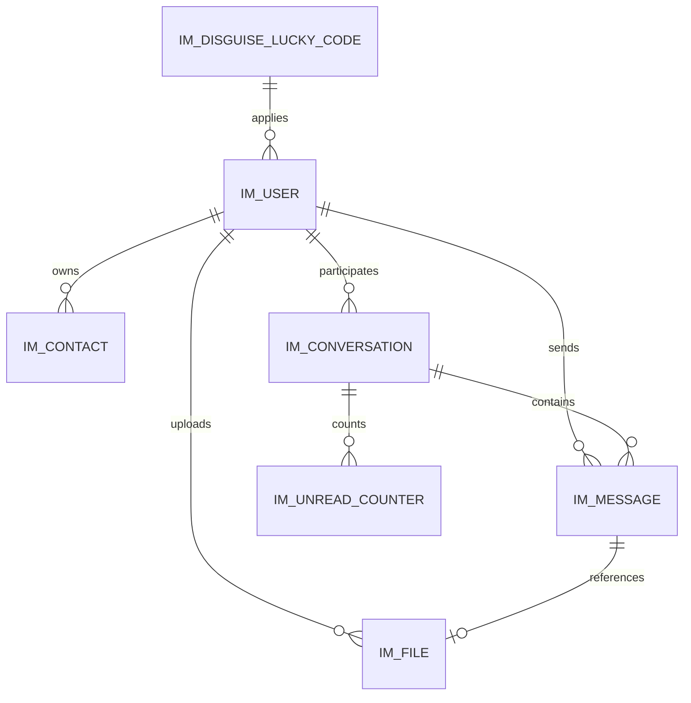

# 数据库字段设计文档 v1.1

适用范围：

* 后端：Spring Boot + PostgreSQL
* 前端：Web 浏览器本地持久化（IndexedDB）
* 场景：1V1 聊天、邮箱登录、幸运数字伪装入口、PIN 解锁本地历史消息、图片与通用文件附件

---

# 1. 文档目标

本文档定义本系统的：

* 后端数据模型
* 前端本地数据模型
* 字段设计与索引建议
* 隐私边界

---

# 2. 设计原则

## 2.1 后端与前端职责分离

后端负责：

* 用户账号
* 联系人关系
* 会话索引
* 消息中转与存档
* 通用附件元数据
* 未读计数

前端负责：

* PIN 校验材料
* 会话密钥密文
* 本地消息密文缓存
* 本地附件密文缓存
* 锁定状态

## 2.2 明确不落后端的数据

以下数据不放后端数据库：

* PIN 明文
* conversationKey 明文
* 本地历史明文消息

## 2.3 列表脱敏原则

会话列表只存和返回脱敏预览，不存真实消息文本与真实文件名。

允许值：

* `[文本消息]`
* `[图片消息]`
* `[文件消息]`

---

# 3. 后端 ER 关系

---

# 4. 后端表设计

## 4.1 用户表 `im_user`

| 字段名 | 类型推荐 | 非空 | 说明 |
| --- | --- | --- | --- |
| id | bigint | 是 | 主键 |
| user_uid | varchar(64) | 是 | 用户唯一 ID |
| display_user_id | varchar(64) | 是 | 对外展示用户 ID |
| nickname | varchar(64) | 是 | 昵称 |
| avatar_url | varchar(255) | 否 | 头像 |
| status | smallint | 是 | 状态 |
| created_at | timestamp | 是 | 创建时间 |
| updated_at | timestamp | 是 | 更新时间 |

索引建议：

* `uk_im_user_user_uid`
* `uk_im_user_display_user_id`
* `idx_im_user_nickname`

说明：

* `display_user_id` 用于搜索页和展示页
* 用户邮箱不作为搜索结果返回字段

## 4.2 联系人表 `im_contact`

| 字段名 | 类型推荐 | 非空 | 说明 |
| --- | --- | --- | --- |
| id | bigint | 是 | 主键 |
| owner_uid | varchar(64) | 是 | 当前用户 |
| peer_uid | varchar(64) | 是 | 联系人用户 |
| remark_name | varchar(64) | 否 | 备注名 |
| pinned | boolean | 是 | 是否置顶 |
| last_message_at | timestamp | 否 | 最后互动时间 |
| created_at | timestamp | 是 | 添加时间 |
| updated_at | timestamp | 是 | 更新时间 |

约束建议：

* `uk_im_contact_owner_peer(owner_uid, peer_uid)`

索引建议：

* `idx_im_contact_owner_uid(owner_uid)`
* `idx_im_contact_owner_uid_last_message_at(owner_uid, last_message_at desc)`
* `idx_im_contact_owner_uid_created_at(owner_uid, created_at desc)`

说明：

* `created_at` 用于最近添加列表
* 联系人列表默认按最近消息时间排序

## 4.3 会话表 `im_conversation`

| 字段名 | 类型推荐 | 非空 | 说明 |
| --- | --- | --- | --- |
| id | bigint | 是 | 主键 |
| conversation_id | varchar(64) | 是 | 会话唯一 ID |
| user_a_uid | varchar(64) | 是 | 参与方 A |
| user_b_uid | varchar(64) | 是 | 参与方 B |
| last_message_id | varchar(64) | 否 | 最后一条消息 ID |
| last_message_type | varchar(32) | 否 | 最后消息类型 |
| last_message_preview | varchar(255) | 否 | 脱敏预览摘要 |
| preview_strategy | varchar(32) | 是 | 预览策略，默认 `masked` |
| last_message_at | timestamp | 否 | 最后消息时间 |
| created_at | timestamp | 是 | 创建时间 |
| updated_at | timestamp | 是 | 更新时间 |

约束建议：

* `uk_im_conversation_conversation_id(conversation_id)`
* `uk_im_conversation_user_pair(user_a_uid, user_b_uid)`

索引建议：

* `idx_im_conversation_last_message_at(last_message_at desc)`

说明：

* `last_message_preview` 仅允许 `[文本消息]`、`[图片消息]`、`[文件消息]`
* 不得写入真实文本片段和真实文件名

## 4.4 消息表 `im_message`

| 字段名 | 类型推荐 | 非空 | 说明 |
| --- | --- | --- | --- |
| id | bigint | 是 | 主键 |
| message_id | varchar(64) | 是 | 消息唯一 ID |
| conversation_id | varchar(64) | 是 | 所属会话 |
| sender_uid | varchar(64) | 是 | 发送者 |
| receiver_uid | varchar(64) | 是 | 接收者 |
| message_type | varchar(16) | 是 | `text / image / file / system` |
| payload_type | varchar(16) | 是 | `plain / ref / encrypted` |
| payload | text | 否 | 消息体或引用信息 |
| file_id | varchar(64) | 否 | 附件 ID |
| server_status | varchar(16) | 是 | 服务端状态 |
| client_msg_time | bigint | 否 | 客户端时间戳 |
| server_msg_time | timestamp | 是 | 服务端时间 |
| deleted | boolean | 是 | 逻辑删除 |

约束建议：

* `uk_im_message_message_id(message_id)`

索引建议：

* `idx_im_message_conversation_id_server_msg_time(conversation_id, server_msg_time desc)`
* `idx_im_message_file_id(file_id)`

说明：

* `message_type` 新增 `file`
* 图片消息和通用文件消息均通过 `file_id` 关联附件表

## 4.5 附件表 `im_file`

说明：

* 该表已从“图片文件元数据”升级为“通用附件元数据”
* 图片是 `file_category=image` 的一种

| 字段名 | 类型推荐 | 非空 | 说明 |
| --- | --- | --- | --- |
| id | bigint | 是 | 主键 |
| file_id | varchar(64) | 是 | 附件唯一 ID |
| uploader_uid | varchar(64) | 是 | 上传者 UID |
| file_name | varchar(255) | 是 | 原始文件名 |
| file_ext | varchar(32) | 否 | 扩展名 |
| file_category | varchar(32) | 是 | `image / document / archive / other` |
| mime_type | varchar(128) | 是 | MIME 类型 |
| file_size | bigint | 是 | 文件大小 |
| previewable | boolean | 是 | 是否可预览 |
| storage_key | varchar(255) | 是 | 对象存储 key |
| access_url | varchar(255) | 否 | 预览地址 |
| download_url | varchar(255) | 否 | 下载地址 |
| encrypt_flag | boolean | 是 | 是否加密上传 |
| created_at | timestamp | 是 | 创建时间 |

## 4.6 伪装入口幸运码表 `im_disguise_lucky_code`

说明：

* 存放后端校验使用的 `luckyCode`
* 明文存储，用于 `POST /api/system/disguise/verify-lucky-number`
* 可按生效时间窗口切换当前有效值

| 字段名 | 类型推荐 | 非空 | 说明 |
| --- | --- | --- | --- |
| id | bigint | 是 | 主键 |
| code_value | varchar(32) | 是 | luckyCode 明文 |
| status | varchar(16) | 是 | `active / inactive` |
| effective_start_at | timestamp | 否 | 生效开始时间 |
| effective_end_at | timestamp | 否 | 生效结束时间 |
| remark | varchar(255) | 否 | 备注 |
| created_at | timestamp | 是 | 创建时间 |
| updated_at | timestamp | 是 | 更新时间 |

约束建议：

* `idx_im_disguise_lucky_code_status(status)`
* `idx_im_disguise_lucky_code_effective_time(effective_start_at, effective_end_at)`

说明：

* 后端按 `status=active` 且命中生效时间窗口的数据进行校验
* 若无有效记录，接口返回“数据库配置缺失/不可用”类错误

约束建议：

* `uk_im_file_file_id(file_id)`

索引建议：

* `idx_im_file_uploader_uid(uploader_uid)`
* `idx_im_file_file_category(file_category)`
* `idx_im_file_created_at(created_at desc)`

说明：

* 图片类附件必须支持预览
* 其他文件类型可按白名单决定 `previewable`

## 4.6 未读计数表 `im_unread_counter`

| 字段名 | 类型推荐 | 非空 | 说明 |
| --- | --- | --- | --- |
| id | bigint | 是 | 主键 |
| owner_uid | varchar(64) | 是 | 未读归属用户 |
| conversation_id | varchar(64) | 是 | 会话 ID |
| unread_count | int | 是 | 未读数 |
| updated_at | timestamp | 是 | 更新时间 |

约束建议：

* `uk_im_unread_counter_owner_conversation(owner_uid, conversation_id)`

---

# 5. 前端 IndexedDB 设计

建议数据库名：

* `hidechat_db`

## 5.1 `app_meta`

| 字段名 | 类型 | 说明 |
| --- | --- | --- |
| key | string | 主键 |
| value | string / json | 配置值 |

推荐内容：

* `disguiseConfig`
* `lastInputLuckyNumber`
* `theme`

## 5.2 `conversation_index_local`

| 字段名 | 类型 | 说明 |
| --- | --- | --- |
| conversation_id | string | 主键 |
| peer_uid | string | 对端 UID |
| peer_nickname | string | 对端昵称 |
| peer_avatar | string | 对端头像 |
| encrypted_conversation_key | string | 加密后的会话密钥 |
| pin_salt | string | PIN 盐值 |
| pin_verifier_hash | string | PIN 校验 hash |
| locked | boolean | 是否锁定 |
| last_message_at | number | 最后消息时间戳 |
| unread_count | number | 本地未读数 |
| preview_strategy | string | 预览策略，默认 `masked` |
| online_state | string | 在线状态缓存 |

索引建议：

* 主键：`conversation_id`
* 索引：`peer_uid`
* 索引：`last_message_at`

说明：

* `preview_strategy` 用于显式约束会话列表脱敏渲染
* `online_state` 可落本地做短时缓存，不作为强一致数据源

## 5.3 `message_local`

| 字段名 | 类型 | 说明 |
| --- | --- | --- |
| message_id | string | 主键 |
| conversation_id | string | 所属会话 |
| sender_uid | string | 发送者 |
| message_type | string | `text / image / file` |
| ciphertext | string | 密文 |
| iv | string | 初始化向量 |
| created_at | number | 创建时间戳 |
| local_status | string | `sending / sent / failed / received` |

## 5.4 `file_cache`

| 字段名 | 类型 | 说明 |
| --- | --- | --- |
| file_id | string | 主键 |
| conversation_id | string | 所属会话 |
| ciphertext_blob | Blob | 密文附件 |
| iv | string | 初始化向量 |
| mime_type | string | MIME 类型 |
| file_category | string | 文件分类 |
| previewable | boolean | 是否可预览 |
| created_at | number | 创建时间戳 |

说明：

* 当前统一使用 `file_cache`
* 若后续图片预览链路复杂，可拆成 `image_cache` 与 `file_cache`

---

# 6. 关系与约束汇总

| 主表 | 关系 | 从表 | 说明 |
| --- | --- | --- | --- |
| im_user | 1:N | im_contact | 一个用户拥有多个联系人视图 |
| im_user | 1:N | im_message | 一个用户可发送 / 接收多条消息 |
| im_user | 1:N | im_file | 一个用户可上传多个附件 |
| im_conversation | 1:N | im_message | 一个会话包含多条消息 |
| im_message | 0..1:1 | im_file | 图片 / 文件消息关联附件 |
| im_user + im_conversation | 1:1 | im_unread_counter | 每用户对每会话一条未读记录 |

---

# 7. 安全与隐私说明

* 不记录 PIN 明文
* `luckyCode` 允许在后端数据库明文存储，用于后端校验
* 会话列表不记录真实消息预览
* 搜索结果不以邮箱作为展示字段
* 本地附件缓存应以密文形式落地
