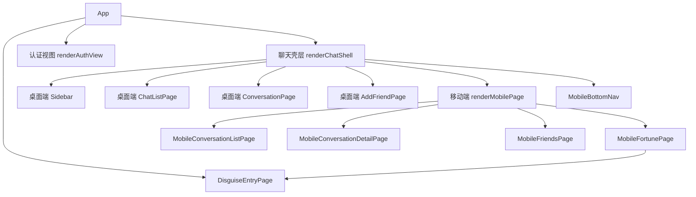

# 项目前端代码讲解文档

## 1. 项目整体简介

这个前端项目是一个“带伪装入口的隐私聊天 Web 应用”。用户第一次看到的不是直接的聊天登录页，而是一个“今日运势 / 幸运数字”的页面，只有输入正确幸运数字后，才会进入下一步登录或聊天流程。

结合当前代码来看，这个前端大致承担了 3 类职责：

1. 伪装入口与登录流程  
   代码在 [frontend/src/pages/disguise/DisguiseEntryPage.tsx](/home/reader/HideChat/frontend/src/pages/disguise/DisguiseEntryPage.tsx) 和 [frontend/src/app/App.tsx](/home/reader/HideChat/frontend/src/app/App.tsx) 中。
2. 聊天界面与交互  
   包括会话列表、聊天详情、发送文本/图片/文件、搜索好友、移动端底部导航。
3. 与后端和浏览器能力对接  
   比如 `fetch` 请求、WebSocket、`localStorage`、IndexedDB 本地缓存。

如果把它想象成一个现实中的产品，用户的大致使用过程是：

1. 打开网站，先看到“运势页”。
2. 输入幸运数字。
3. 如果本地已经有登录态，直接进入聊天；否则进入认证页。
4. 登录成功后加载联系人、会话列表、历史消息。
5. 在聊天页继续发消息、传文件、查看最近会话。

前端不是“只负责画页面”。在这个项目里，前端还负责：

- 保存登录 token
- 缓存历史消息
- 根据屏幕宽度决定桌面/手机布局
- 维护大量页面状态
- 处理 WebSocket 实时消息

---

## 2. 技术栈说明

### React

本项目用 React 来写界面。你可以把 React 理解成“用组件来拼页面”的方案。  
例如：

- `App` 是总控组件
- `DisguiseEntryPage` 是伪装入口页面组件
- `MobileConversationListPage` 是移动端最近会话页组件

组件的好处是：可以把一个大页面拆成很多小块，每一块单独负责自己的显示逻辑。

### TypeScript

本项目不是纯 JavaScript，而是 TypeScript。  
TypeScript 的作用可以简单理解为：给代码加“类型说明”，减少传错数据的风险。

例如在 [frontend/src/types/index.ts](/home/reader/HideChat/frontend/src/types/index.ts) 里定义了：

- `ConversationItem`：表示一个会话项应该长什么样
- `ChatMessage`：表示一条消息有哪些字段
- `LocalUser`：表示当前用户信息

这会让你读代码时更容易知道“这个函数收的是什么、返回的是什么”。

### Vite

项目用 Vite 启动和构建。你可以把它理解为“前端开发服务器 + 打包工具”。

在 [frontend/package.json](/home/reader/HideChat/frontend/package.json) 里可以看到：

- `npm run dev`：本地开发
- `npm run build`：构建生产包
- `npm test`：单元测试

在 [frontend/vite.config.ts](/home/reader/HideChat/frontend/vite.config.ts) 里还能看到代理配置：

- `/api` 代理到后端 `8080`
- `/ws` 代理到后端 WebSocket

这说明开发时前端和后端通常是分开跑的，但浏览器访问前端时，请求会被 Vite 转发给后端。

### 原生 Fetch + WebSocket

这个项目没有用 `axios`，而是直接用浏览器自带的 `fetch` 发 HTTP 请求。  
实时聊天则使用浏览器自带的 `WebSocket`。

相关代码都在 [frontend/src/api/client.ts](/home/reader/HideChat/frontend/src/api/client.ts)。

### 纯 CSS

项目没有使用 Tailwind、CSS Modules、styled-components。  
目前样式主要来自：

- [frontend/src/app/app.css](/home/reader/HideChat/frontend/src/app/app.css)
- [frontend/src/pages/disguise/DisguiseEntryPage.css](/home/reader/HideChat/frontend/src/pages/disguise/DisguiseEntryPage.css)

这说明它采用的是比较传统、比较直白的 CSS 写法。

### 测试工具

项目里用到了：

- `Vitest`：跑单元测试
- `@testing-library/react`：测 React 界面行为
- `Playwright`：跑浏览器端 E2E

这说明作者不仅写了页面，也有在验证主流程。

### 本项目没有用到但初学者容易默认会有的技术

当前代码里没有看到这些东西进入主流程：

- React Router：没有路由库，页面切换主要靠 `App.tsx` 中的状态变量
- Redux / Zustand：没有专门的全局状态管理库
- React Query / SWR：没有专门的服务端数据缓存库

也就是说，这个项目更像是“一个 React 单页应用，但把流程控制都自己写在组件里”。

---

## 3. 前端目录结构讲解

结合 `frontend/src` 当前实际目录，可以重点看下面这些：

```text
frontend/
├── src/
│   ├── app/          # 应用入口与总控
│   ├── api/          # 后端请求封装
│   ├── pages/        # 页面级组件
│   ├── components/   # 可复用组件
│   ├── types/        # 类型定义
│   ├── utils/        # 通用工具函数
│   ├── storage/      # 本地存储封装（IndexedDB）
│   ├── services/     # 面向业务的服务类
│   ├── store/        # 简单状态工具
│   ├── crypto/       # 加密/哈希辅助
│   └── hooks/        # 自定义 Hook
├── tests/
│   ├── unit/
│   ├── e2e/
│   └── browser/
└── vite.config.ts
```

### `src/app/`

这里最重要。  
[frontend/src/app/main.tsx](/home/reader/HideChat/frontend/src/app/main.tsx) 是 React 真正挂载到页面的入口。  
[frontend/src/app/App.tsx](/home/reader/HideChat/frontend/src/app/App.tsx) 是整个前端的“总导演”。

如果你时间有限，优先看这里。

### `src/api/`

[frontend/src/api/client.ts](/home/reader/HideChat/frontend/src/api/client.ts) 负责所有接口请求。

好处是：页面和组件不需要直接写很多 `fetch("/api/...")`，而是调用已经封装好的函数，比如：

- `loginByPassword`
- `listConversations`
- `sendMessage`
- `uploadFile`

### `src/pages/`

这里放页面级组件。当前主要有：

- `disguise/DisguiseEntryPage.tsx`
- `mobile/MobileConversationListPage.tsx`
- `mobile/MobileConversationDetailPage.tsx`
- `mobile/MobileFriendsPage.tsx`
- `mobile/MobileFortunePage.tsx`

这些组件通常负责“一整块页面区域”。

### `src/components/`

这里放更小、更通用的 UI 组件。当前比较典型的是：

- [frontend/src/components/mobile/MobileBottomNav.tsx](/home/reader/HideChat/frontend/src/components/mobile/MobileBottomNav.tsx)

它只负责底部导航按钮，不负责业务数据。

### `src/types/`

[frontend/src/types/index.ts](/home/reader/HideChat/frontend/src/types/index.ts) 非常值得初学者看。  
因为这里能帮助你快速理解这个项目里的“数据长什么样”。

### `src/storage/`

[frontend/src/storage/index.ts](/home/reader/HideChat/frontend/src/storage/index.ts) 封装了 IndexedDB。  
你可以把它理解成“浏览器里的小型本地数据库”。

### `src/services/`

这里是一些业务服务类。目前有：

- `MessageEncryptionService.ts`
- `AutoLockService.ts`

名字听起来很重要，但当前主流程里并没有真正深度接入它们，这一点后面会专门讲。

### `src/store/`

目前不是 Redux 那种完整 store，而是一些简单状态函数。  
这说明项目还没有形成复杂的全局状态体系。

### `src/hooks/`

目前只有一个占位 Hook：`usePlaceholder`。  
对初学者来说，这正好说明：目录设计预留了 Hook 的位置，但实际业务并没有真正沉淀到这里。

### 初学者最值得优先看的目录

建议顺序：

1. `src/app/`
2. `src/types/`
3. `src/api/`
4. `src/pages/`
5. `src/storage/`
6. `tests/`

---

## 4. 项目运行流程

### 项目如何启动

在 [frontend/package.json](/home/reader/HideChat/frontend/package.json) 中：

- `npm run dev` 会启动 Vite 开发服务器
- Vite 读取 `index.html`
- 再加载 `src/app/main.tsx`

### 入口文件是哪个

真正的前端入口是 [frontend/src/app/main.tsx](/home/reader/HideChat/frontend/src/app/main.tsx)：

```tsx
ReactDOM.createRoot(document.getElementById("root")!).render(
  <React.StrictMode>
    <App />
  </React.StrictMode>
);
```

这段代码可以简单理解为：

- 找到 HTML 里的 `#root`
- 把 React 应用挂进去
- 最外层渲染 `App`

### 页面怎么被渲染出来

进入 `App` 后，真正控制页面显示的是几个状态变量：

- `screen`：当前处于 `disguise`、`auth` 还是 `chat`
- `publicView`：伪装页显示幸运数字还是运势
- `chatView`：桌面端是聊天列表、聊天详情还是加好友页
- `mobilePage`：移动端当前是最近会话、聊天详情、好友页还是运势页

也就是说，本项目不是“用 URL 路由切页面”，而是“用 React state 手动控制切页面”。

### 一个用户打开页面后，前端内部大致发生了什么

按时间顺序可以这样理解：

1. `main.tsx` 渲染 `App`
2. `App` 默认把 `screen` 设为 `disguise`
3. `DisguiseEntryPage` 发请求加载运势和伪装配置
4. `App` 还会尝试读取本地 token
5. 如果本地有 token，就调用 `fetchCurrentUser()`，尝试恢复登录态
6. 用户输入幸运数字
7. 如果幸运数字通过：
   - 有 token：直接进聊天
   - 没 token：进入认证页
8. 登录后，`App` 会并发加载：
   - 联系人
   - 会话列表
   - 最近联系人
   - 每个会话的消息历史或本地缓存
9. 如果进入聊天页，还会建立 WebSocket 连接
10. 之后消息发送、ACK、已读回执都在 `App` 内继续流转

---

## 5. 页面与组件关系图

### 主要页面/视图

当前项目不是传统“多页面网站”，而是一个 `App` 里切换多个视图。

### 视图关系



### 组件之间如何传值

这个项目主要通过“父组件把数据和函数传给子组件”的方式协作，也就是常见的 `props`。

例如：

- `App` 把 `conversations`、`chatSearchQuery`、`onOpenConversation` 传给 `MobileConversationListPage`
- `App` 把 `messages`、`composer`、`onSendMessage` 传给 `MobileConversationDetailPage`
- `App` 把 `onShowChatList`、`onShowFriends`、`onShowFortune` 传给 `MobileBottomNav`

你可以这样理解：

- 子组件负责“展示和触发”
- 父组件负责“保存数据和真正处理逻辑”

这也是 React 中很常见的设计。

---

## 6. 核心代码讲解

这一章会挑最关键的文件讲，不追求逐行解释，而是帮助你抓住“这个文件在全局中的角色”。

### 6.1 [frontend/src/app/main.tsx](/home/reader/HideChat/frontend/src/app/main.tsx)

#### 这个文件负责什么

负责把 React 应用挂载到浏览器页面上。

#### 为什么它重要

它是整个前端的起点。没有它，`App` 就不会显示。

#### 初学者应该关注什么

- `ReactDOM.createRoot(...)`
- `<App />`
- `React.StrictMode`

#### 概念解释

- `StrictMode`：开发模式下帮助你发现不安全写法，不是业务功能。

---

### 6.2 [frontend/src/app/App.tsx](/home/reader/HideChat/frontend/src/app/App.tsx)

#### 这个文件负责什么

这是当前项目最核心的文件，几乎负责整个前端主流程：

- 页面切换
- 登录流程
- 恢复本地登录态
- 加载联系人 / 会话 / 历史消息
- 消息发送
- WebSocket 接入
- 桌面端 / 移动端切换

#### 为什么它重要

因为你只要看懂它，就基本能看懂整个项目是怎么运作的。

#### 初学者阅读时重点看什么

建议按下面顺序看：

1. 顶部 `useState` 列表  
   这能帮你知道 App 在管理哪些状态。
2. 一组 `useEffect`  
   这里处理“页面启动后做什么”“状态变化后做什么”。
3. 关键事件函数  
   比如 `handleAuthSubmit`、`handleSendMessage`、`handleAddContact`。
4. `renderPublicView / renderAuthView / renderChatShell`  
   这里能看出页面是怎么切换的。

#### 关键状态变量

- `screen`：总页面状态
- `session`：当前登录用户和 token
- `conversations`：会话列表
- `messages`：一个对象，按 `conversationId` 存每个会话的消息数组
- `activeConversationId`：当前选中的会话
- `composer`：输入框文字
- `statusText`：底部状态提示

#### 为什么这样设计

作者把很多数据集中放在 `App`，这样所有页面都能共享。  
优点是：流程集中，好找。  
缺点是：文件会越来越大，后期维护成本会上升。

#### 关键代码片段说明 1：登录态恢复

```tsx
const persistedTokens = getPersistedAuthTokens();
if (!persistedTokens) {
  return;
}
const currentUser = await fetchCurrentUser();
await hydrateAuthenticatedState(currentUser, persistedTokens, false);
```

它的意思是：

- 先看看本地有没有 token
- 如果有，就去后端确认当前用户
- 然后把联系人、会话、消息等一起恢复出来

#### 关键代码片段说明 2：消息乐观更新

`dispatchOutgoingMessage` 里先调用 `createMessage(...)` 生成一条本地消息，再先显示到界面上，然后再决定：

- WebSocket 在线：走实时发送
- WebSocket 不在线：退回 HTTP 发送

这叫“乐观更新”。  
简单说就是：先让用户感觉消息已经发出，再等后端确认。

#### 关键代码片段说明 3：桌面端和移动端分流

项目不是用两套前端，而是在同一个 `App` 中根据 `matchMedia("(max-width: 900px)")` 判断：

- 小屏：走移动端页面组件
- 大屏：走桌面端布局

这就是“响应式 + 条件渲染”的组合用法。

#### 初学者要特别注意

`App.tsx` 里混合了很多职责：

- UI 渲染
- 状态管理
- 网络请求调度
- WebSocket 处理
- 本地缓存恢复

这在小项目里能跑，但在更大项目里通常会拆分。

---

### 6.3 [frontend/src/pages/disguise/DisguiseEntryPage.tsx](/home/reader/HideChat/frontend/src/pages/disguise/DisguiseEntryPage.tsx)

#### 这个文件负责什么

负责“伪装入口页”，也就是用户最先看到的页面。

#### 为什么它存在

这个产品的特殊点就是：聊天入口被伪装成普通运势页。  
所以这个页面不是装饰，它是主链路的一部分。

#### 输入是什么

它接收 3 个 props：

- `onLuckyNumberVerified`
- `onSwitchToFortune`
- `initialView`

#### 输出是什么

严格说它不“返回数据”，而是：

- 渲染幸运数字视图或运势视图
- 在验证成功后调用 `onLuckyNumberVerified()`

#### 关键函数

##### `normalizeLuckyNumberInput`

作用：把用户输入标准化。  
比如把全角数字转成半角、去掉一些不可见字符。

这很适合初学者学习，因为它体现了一个真实业务问题：  
用户输入不一定干净，前端应该先做一层整理。

##### `handleVerifyLuckyNumber`

作用：

1. 先校验输入是否为空
2. 调 `verifyLuckyNumber`
3. 成功则回调父组件
4. 失败则显示错误

#### 初学者要关注的概念

- `useEffect`：页面加载后请求数据
- 本地状态：`view`、`isLoading`、`error`
- 条件渲染：根据 `view` 切换内容
- 事件处理：按钮点击、回车触发

---

### 6.4 [frontend/src/pages/mobile/MobileConversationListPage.tsx](/home/reader/HideChat/frontend/src/pages/mobile/MobileConversationListPage.tsx)

#### 这个文件负责什么

负责移动端“最近会话列表”。

#### 它为什么重要

在手机模式下，用户登录后先看到的就是它，而不是直接进入某个会话。

#### 输入是什么

它不自己拿数据，全靠 `props`：

- `conversations`
- `activeConversationId`
- `chatSearchQuery`
- `onOpenConversation`
- `onShowFriendsPage`

#### 输出是什么

输出一个会话列表界面；用户点击某项后，通过 `onOpenConversation` 告诉父组件“我要打开这个会话”。

#### 初学者阅读重点

这是很典型的“展示型组件”：

- 没有请求接口
- 没有自己管理复杂业务状态
- 主要就是把数据渲染出来

你可以把它理解成“纯接单干活的 UI 组件”。

---

### 6.5 [frontend/src/pages/mobile/MobileConversationDetailPage.tsx](/home/reader/HideChat/frontend/src/pages/mobile/MobileConversationDetailPage.tsx)

#### 这个文件负责什么

负责移动端聊天详情页。

#### 它和谁关联

它和 `App.tsx` 关系非常紧密，因为：

- `messages` 来自 `App`
- `composer` 来自 `App`
- `onSendMessage` 在 `App` 里实现
- `renderMessageBody` 也来自 `App`

#### 这说明什么

说明这个组件主要负责“显示聊天详情 + 触发操作”，真正业务逻辑仍在父组件。

#### 关键点

- 没有会话时，显示空状态
- 有会话时，渲染消息列表
- 文本框和文件选择器只是触发父组件方法

#### 初学者可以学到什么

- 如何通过 `props` 复用父组件里的逻辑
- 如何处理“空状态”和“正常状态”
- 如何给 `<input type="file">` 绑定选择文件事件

---

### 6.6 [frontend/src/pages/mobile/MobileFriendsPage.tsx](/home/reader/HideChat/frontend/src/pages/mobile/MobileFriendsPage.tsx)

#### 这个文件负责什么

负责移动端搜索用户和添加好友。

#### 为什么存在

聊天系统不能只有聊天，还要先有联系人。  
这个页面就是联系人入口。

#### 初学者阅读重点

这个页面展示了两个常见前端模式：

1. 搜索结果列表
2. 最近记录列表

页面本身不直接调用 `fetch`，而是调用父组件传进来的 `onFriendSearch`、`onAddContact`。

---

### 6.7 [frontend/src/pages/mobile/MobileFortunePage.tsx](/home/reader/HideChat/frontend/src/pages/mobile/MobileFortunePage.tsx)

#### 这个文件负责什么

它本质上是一个“包装组件”。  
它并没有自己重新写运势页面，而是直接复用 `DisguiseEntryPage`，只是把 `initialView` 固定成 `"fortune"`。

#### 这能学到什么

这是一种很实用的复用方式：

- 不重复写页面
- 通过改 props 让同一个组件以不同方式显示

---

### 6.8 [frontend/src/components/mobile/MobileBottomNav.tsx](/home/reader/HideChat/frontend/src/components/mobile/MobileBottomNav.tsx)

#### 这个文件负责什么

负责移动端底部导航栏。

#### 为什么它重要

它体现了“通用组件”的典型写法：

- 自己不关心会话数据
- 只关心当前高亮的是哪个 section
- 点击后调用回调函数

#### 输入

- `activeSection`
- `onShowChatList`
- `onShowFriends`
- `onShowFortune`

#### 输出

渲染 3 个导航按钮，并在点击时通知父组件。

---

### 6.9 [frontend/src/api/client.ts](/home/reader/HideChat/frontend/src/api/client.ts)

#### 这个文件负责什么

负责整个项目的 API 请求封装，是前端和后端之间最重要的桥梁。

#### 为什么它重要

如果没有这层封装，所有组件都会直接写 `fetch`，代码会很乱。

#### 初学者阅读顺序建议

先看：

1. `requestJson`
2. `refreshAccessToken`
3. 具体业务函数，比如 `loginByPassword`、`listConversations`

#### 核心函数 1：`requestJson`

这是所有请求的底层公共方法。

它做了很多事：

- 自动补 `Content-Type`
- 需要登录时自动加 `Authorization`
- 统一解析后端响应格式
- 401 时尝试刷新 token
- 把普通错误包装成 `ApiError`

这相当于“整个前端请求系统的地基”。

#### 核心函数 2：`refreshAccessToken`

当 token 失效时，它会调用 `/auth/refresh-token`。  
而且它用 `refreshPromise` 做了并发保护，避免多个请求同时重复刷新。

这点很值得学习，因为它不是简单“报错就跳登录”，而是尽量自动恢复登录态。

#### 具体业务函数举例

##### `loginByPassword`

输入：

- `email`
- `password`

输出：

- `tokens`
- `user`

它还会顺手把 token 存入 `localStorage`。

##### `listMessageHistory`

输入：

- `conversationId`

输出：

- `ChatMessage[]`

它还负责把后端返回的数据映射成前端统一的消息结构。

##### `uploadFile`

它不是一步完成，而是三步：

1. 请求上传签名
2. 直接 `PUT` 文件到上传地址
3. 通知后端上传完成

这是一种很常见的文件上传方案。

##### `createChatWebSocket`

负责创建聊天 WebSocket，并把 token 放到 URL 查询参数里。

---

### 6.10 [frontend/src/types/index.ts](/home/reader/HideChat/frontend/src/types/index.ts)

#### 这个文件负责什么

集中定义项目里的核心数据结构。

#### 为什么它重要

初学者经常一上来就看组件，其实先看类型会更快。  
因为类型能先告诉你：这个项目里“用户、联系人、会话、消息、文件”分别长什么样。

#### 重点类型

##### `ConversationItem`

代表会话列表中的一项。  
重点字段：

- `conversationId`
- `peerUid`
- `remarkName`
- `lastMessagePreview`
- `lastMessageAt`
- `unreadCount`

##### `ChatMessage`

代表一条消息。  
重点字段：

- `messageId`
- `conversationId`
- `senderUid`
- `receiverUid`
- `payload`
- `messageType`
- `serverStatus`

##### `FileInfo`

代表上传完成后的文件信息。

#### 初学者建议

读组件时一旦看到某个类型不认识，马上回这里查。  
这是最快建立整体认知的方法。

---

### 6.11 [frontend/src/storage/index.ts](/home/reader/HideChat/frontend/src/storage/index.ts)

#### 这个文件负责什么

封装浏览器 IndexedDB，用来缓存会话消息。

#### 为什么它重要

这个项目不是每次刷新都只依赖后端，还会尝试从本地缓存恢复消息。

#### 核心函数

- `saveCachedConversation`
- `loadCachedConversation`
- `listCachedConversations`
- `clearCachedConversations`

#### 你可以怎么理解

它像一个“浏览器里的消息仓库”。

比如：

- 发送消息后，`App` 会把消息存进去
- 登录恢复时，`App` 会优先尝试从这里取缓存

#### 一个非常重要的观察

虽然目录里有 `crypto/`、`MessageEncryptionService`，README 里也提到“本地加密消息缓存”，但从当前真实代码看：

- `storage/index.ts` 里保存的是 `ChatMessage[]` 原始对象
- 没有看到真正的加密后再落库
- `MessageEncryptionService` 也只是“包装存取”，没有真的加密

所以当前代码更接近“本地缓存已实现，但真正的本地加密还没有落到主流程”。

这个点很重要，初学者不要被命名误导。

---

### 6.12 [frontend/src/utils/index.ts](/home/reader/HideChat/frontend/src/utils/index.ts)

#### 这个文件负责什么

提供两个简单但很关键的工具函数：

- `createMessage`
- `buildMessagePreview`

#### `createMessage` 的作用

在消息真正发给后端前，先构造一条前端本地消息。

这让界面可以立刻显示“发送中”的消息气泡。

#### `buildMessagePreview` 的作用

为会话列表生成预览文案，但这里用的是脱敏占位：

- 图片显示 `[图片消息]`
- 文件显示 `[文件消息]`
- 文本显示 `[文本消息]`

这和项目“隐藏聊天内容”的产品思路是有关联的。

---

### 6.13 [frontend/src/store/index.ts](/home/reader/HideChat/frontend/src/store/index.ts)

#### 这个文件负责什么

提供一个很小的缓存状态工具，不是完整的全局状态中心。

#### 当前内容

- `createChatCacheState`
- `markChatCacheHydrated`
- `resetChatCacheState`
- `shouldRefreshChatCache`

#### 初学者要知道

这里的 `store` 名字容易让人以为是 Redux 风格的大状态系统，但实际上不是。  
它目前只是几个纯函数。

---

### 6.14 [frontend/src/crypto/index.ts](/home/reader/HideChat/frontend/src/crypto/index.ts)

#### 这个文件负责什么

目前提供了：

- `sha256Hex`
- `serializeMessageCache`
- `deserializeMessageCache`

#### 关键点

`sha256Hex` 用浏览器的 `crypto.subtle.digest` 做 SHA-256 哈希。  
这适合做“验证值”或“摘要”，但不等于真正的消息加密。

#### 初学者容易误解的地方

“哈希”和“加密”不是一回事。

- 哈希：通常不可逆，更多用于校验
- 加密：可解密恢复原文

当前代码里更像是“有哈希辅助”，但没有完整的消息加解密链路。

---

### 6.15 [frontend/src/services/MessageEncryptionService.ts](/home/reader/HideChat/frontend/src/services/MessageEncryptionService.ts)

#### 这个文件负责什么

名字叫“消息加密服务”，但当前实际做的事情是：

- 限制每个会话最多缓存多少条消息
- 调用 `storage` 存取消息

#### 为什么要特别说明

因为文件名很容易让学习者误以为“这里已经实现了消息加密”。  
从当前代码看，它并没有真正加密消息内容。

#### 这说明什么

项目可能处于“为后续隐私功能预留结构，但还没有完全接上”的阶段。

---

### 6.16 [frontend/src/services/AutoLockService.ts](/home/reader/HideChat/frontend/src/services/AutoLockService.ts)

#### 这个文件负责什么

监听页面可见性变化，比如浏览器标签页切到后台时触发处理。

#### 当前真实作用

它可以：

- 注册 `visibilitychange`
- 记录当前页面是否隐藏
- 触发隐藏/显示回调

#### 但要注意

当前主流程 `App.tsx` 没有看到对它的实际接入。  
所以它更像“已写好基础设施，但没有成为现在的主链路逻辑”。

---

### 6.17 [frontend/src/hooks/index.ts](/home/reader/HideChat/frontend/src/hooks/index.ts)

这里只有一个：

```ts
export function usePlaceholder(): string {
  return "hook-pending";
}
```

这说明：

- 项目目录上预留了 Hook 层
- 但目前还没有真正把可复用业务逻辑沉淀成自定义 Hook

对初学者来说，这也是一个真实的工程信号：  
不是所有目录一开始都“内容很完整”，有些是为了后续扩展先占位。

---

## 7. 数据流与状态流讲解

这一章是理解整个项目最关键的部分。

### 数据从哪里来

当前项目的数据主要来自 3 个地方：

1. 后端接口
2. WebSocket 实时消息
3. 浏览器本地存储

具体来说：

- 用户信息、联系人、会话列表、历史消息、搜索结果来自后端 HTTP
- 新消息、ACK、已读回执来自 WebSocket
- token 来自 `localStorage`
- 历史消息缓存来自 IndexedDB

### 用户操作后数据如何变化

以“发送文本消息”为例：

1. 用户在输入框输入文字
2. `composer` 状态更新
3. 点击发送按钮
4. `handleSendMessage` 被调用
5. `dispatchOutgoingMessage` 创建一条本地 optimistic message
6. `messages` 状态先更新，页面立刻显示新消息
7. 再走 WebSocket 或 HTTP 发给后端
8. 后端回 ACK 后，消息状态可能从 `sending` 变成 `delivered`

### 状态存在哪里

这个项目的状态可以分成 4 类：

#### 1. 组件本地状态

例如 `DisguiseEntryPage` 里的：

- `view`
- `luckyCodeInput`
- `error`
- `isLoading`

这些只影响当前页面组件。

#### 2. App 级共享状态

这是当前项目最主要的状态层，集中在 `App.tsx`：

- `session`
- `conversations`
- `messages`
- `contacts`
- `activeConversationId`

这些状态会影响多个页面，所以被放在 `App` 顶层。

#### 3. 持久化状态

- `localStorage` 里的 token
- IndexedDB 里的消息缓存

刷新页面后还能恢复。

#### 4. 服务端状态

后端接口返回的数据，本质上也属于服务端状态。  
只是这个项目没有用 React Query 之类的库，所以由 `App.tsx` 手动保存到 React state 中。

### props、state、hook 在项目中怎么用

#### props

用于父子组件传值。  
例如 `App -> MobileConversationDetailPage`。

#### state

用于记住界面和数据当前状态。  
例如 `useState("")` 保存输入框内容。

#### hook

项目主要使用的是 React 内置 Hook：

- `useState`
- `useEffect`
- `useRef`

自定义 Hook 目前几乎还没真正用起来。

### `useRef` 在这个项目里的作用

在 `App.tsx` 里有几个 `ref`：

- `wsRef`
- `conversationsRef`
- `activeConversationIdRef`

你可以把 `ref` 理解成“不会因为重新渲染就丢失的盒子”。  
这里主要用来：

- 保存当前 WebSocket 实例
- 在异步回调中拿到最新会话数据

---

## 8. 接口调用与异步处理

### 项目如何请求后端

全部统一走 [frontend/src/api/client.ts](/home/reader/HideChat/frontend/src/api/client.ts)。

例如：

- 登录：`loginByPassword`
- 列表：`listConversations`
- 历史消息：`listMessageHistory`
- 搜索用户：`searchUsers`

### 请求代码在哪里

请求底层在 `requestJson`。  
业务接口函数是在同一个文件里继续往下封装出来的。

### 前端如何处理加载中、成功、失败

当前项目主要用最直接的方式：

- 开始请求前：设置 `isLoading` 或其他 loading state
- 成功：更新对应 state
- 失败：`catch` 后写入错误信息或 `statusText`

例如 `DisguiseEntryPage`：

- `setIsLoading(true)`
- 请求
- 成功后 `setFortune(...)`
- 失败后 `setError(...)`
- 最后 `setIsLoading(false)`

`App.tsx` 里则更多使用：

- `setStatusText("...")`

来给用户一个统一的文字提示。

### 前端如何把接口数据转成页面展示

一个典型例子是 `listMessageHistory`：

1. 先调 `/message/history`
2. 收到后端消息列表
3. 用 `mapMessage` 转成前端统一的 `ChatMessage`
4. 再存进 `messages` state
5. 页面根据 `messages` 渲染聊天气泡

### 文件上传的异步处理

这是本项目里比较有代表性的异步链路：

1. 用户选中文件
2. `handleFileSelected(file)`
3. 调 `uploadFile(file)`
4. `uploadFile` 里先请求签名
5. 再真正上传文件内容
6. 最后通知后端“上传完成”
7. 返回 `FileInfo`
8. 前端再把这个文件作为一条消息发送出去

这说明一个真实项目中的“发送文件”通常不是一个接口就结束。

---

## 9. 样式方案讲解

### 项目用了什么样式方案

当前是“全局 CSS + 页面 CSS”的传统方案。

主要文件：

- [frontend/src/app/app.css](/home/reader/HideChat/frontend/src/app/app.css)
- [frontend/src/pages/disguise/DisguiseEntryPage.css](/home/reader/HideChat/frontend/src/pages/disguise/DisguiseEntryPage.css)

### 样式文件怎么组织

#### `app.css`

更像应用级总样式，里面有：

- CSS 变量
- 全局元素重置
- 聊天页布局
- 按钮、卡片、列表、聊天消息等通用样式

#### `DisguiseEntryPage.css`

更像该页面自己的独立视觉风格。  
它给伪装入口页用了单独的渐变背景和卡片样式。

### 哪些样式是全局的，哪些是局部的

严格来说，这两个 CSS 文件都会进入全局作用域，因为它们不是 CSS Module。  
只是从“组织习惯”上：

- `app.css` 更偏全局
- `DisguiseEntryPage.css` 更偏某个页面专用

### 初学者应该如何阅读这些样式

建议这样读：

1. 先看 `:root`  
   这里定义了颜色变量、圆角、阴影等设计变量。
2. 再看布局类  
   比如 `.app-root`、`.chat-page`、`.sidebar`、`.messages`
3. 最后看组件类  
   比如 `.btn`、`.avatar`、`.bubble`

### 这个项目样式层的一个特点

类名写得比较语义化，比如：

- `chat-item`
- `search-box`
- `empty-panel`
- `mobile-nav`

这对初学者比较友好，因为你看到类名大概就能猜到它是做什么的。

---

## 10. 一个完整功能链路示例

这里选“发送文本消息”这条链路，因为它最能体现这个项目的前端运作方式。

### 1. 用户做了什么

用户在聊天详情页输入文字，然后点击“发送”。

### 2. 触发了哪个组件 / 函数

桌面端和移动端最终都会调用 `App.tsx` 中的：

- `handleSendMessage`

它内部继续调用：

- `dispatchOutgoingMessage`

### 3. 状态怎么变

`handleSendMessage` 会把当前输入框内容读出来，然后先：

- 清空 `composer`

接着 `dispatchOutgoingMessage` 会调用 `createMessage(...)` 生成一条前端本地消息，再执行：

- `applyIncomingMessage(optimisticMessage)`

于是：

- `messages` 更新
- `conversations` 中该会话的最后消息预览和时间更新
- 界面立即显示这条消息

### 4. 是否发请求

会。

逻辑是：

- 如果 WebSocket 已连接，走 `socket.send(...)`
- 否则走 `sendMessage(...)` HTTP 接口

### 5. 页面如何更新

因为 React state 已更新，消息列表会自动重新渲染。  
用户会先看到“发送中的消息”。

如果后端返回 ACK 或完整消息：

- `reconcileAck`
- `applyIncomingMessage`

会继续把消息状态修正为已送达。

### 6. 最终效果是什么

用户看到：

- 自己刚发出的消息立即出现在界面
- 会话列表时间刷新
- 若发送成功，消息状态变得更稳定

### 这条链路为什么值得学习

因为它同时包含了很多前端核心概念：

- 事件处理
- 本地状态更新
- 乐观更新
- 异步请求
- WebSocket
- 列表自动重渲染

---

## 11. 初学者阅读顺序建议

### 如果想最快看懂项目，建议按这个顺序看

1. [frontend/src/types/index.ts](/home/reader/HideChat/frontend/src/types/index.ts)  
   先认识数据结构。
2. [frontend/src/app/main.tsx](/home/reader/HideChat/frontend/src/app/main.tsx)  
   知道入口在哪里。
3. [frontend/src/app/App.tsx](/home/reader/HideChat/frontend/src/app/App.tsx)  
   先只看 state、effect、render 函数名，不用一开始就抠细节。
4. [frontend/src/api/client.ts](/home/reader/HideChat/frontend/src/api/client.ts)  
   看前端到底和后端怎么通信。
5. [frontend/src/pages/disguise/DisguiseEntryPage.tsx](/home/reader/HideChat/frontend/src/pages/disguise/DisguiseEntryPage.tsx)  
   看入口页如何请求数据和处理验证。
6. 4 个移动端页面组件  
   看父子组件传值和展示逻辑。
7. [frontend/src/storage/index.ts](/home/reader/HideChat/frontend/src/storage/index.ts)  
   看本地缓存怎么做。
8. 测试文件，尤其是 [frontend/tests/e2e/app-flow.test.tsx](/home/reader/HideChat/frontend/tests/e2e/app-flow.test.tsx)  
   它会把“用户怎么走完整流程”串起来。

### 30~60 分钟快速上手阅读路径

#### 前 10 分钟

- 看 `types/index.ts`
- 看 `main.tsx`
- 看 `package.json`

目标：知道项目用什么技术、入口在哪、核心数据有哪些。

#### 接下来 20 分钟

- 看 `App.tsx` 顶部的 state
- 看 `handleAuthSubmit`
- 看 `hydrateAuthenticatedState`
- 看 `dispatchOutgoingMessage`
- 看 `renderChatShell`

目标：理解主流程。

#### 再花 10~15 分钟

- 看 `api/client.ts`
- 看 `DisguiseEntryPage.tsx`
- 看 `storage/index.ts`

目标：理解接口、伪装页、本地缓存。

#### 最后 10 分钟

- 看 `tests/e2e/app-flow.test.tsx`

目标：从测试角度再复盘一次真实用户流程。

---

## 12. 项目中的前端知识点清单

下面这些知识点，在当前项目里都能找到真实代码对应。

### JSX

React 写 UI 的语法。  
比如 `return (<div>...</div>)`。  
在所有组件文件里都能看到。

### 组件

把 UI 拆成独立单元。  
例如：

- `App`
- `DisguiseEntryPage`
- `MobileBottomNav`

### props

父组件传给子组件的数据和函数。  
例如 `MobileConversationListPage` 接收很多回调函数。

### state

组件内部会变化的数据。  
例如 `composer`、`screen`、`isLoading`。

### Hook

React 提供的函数式能力。  
当前项目大量使用：

- `useState`
- `useEffect`
- `useRef`

### 条件渲染

根据条件显示不同 UI。  
例如 `screen === "chat"` 时才渲染聊天壳层。

### 列表渲染

用数组 `.map(...)` 渲染会话列表、消息列表、搜索结果列表。

### 事件处理

例如：

- `onClick`
- `onChange`
- `onKeyDown`

### 异步请求

通过 `async/await` 请求后端。  
例如 `handleFriendSearch`、`handleAuthSubmit`。

### 模块化

把不同职责放到不同文件：

- `api`
- `types`
- `storage`
- `services`

### 类型定义

TypeScript 接口定义数据结构。  
例如 `ChatMessage`。

### 浏览器本地存储

- `localStorage`：存 token
- IndexedDB：存消息缓存

### WebSocket

用于实时聊天消息和已读同步。

### 响应式布局

通过 `matchMedia` 判断是否移动端，而不是完全依赖 CSS。

### 乐观更新

消息先显示，后确认。  
这是聊天产品中很典型的体验优化。

---

## 13. 当前代码中值得注意的问题

这一章不是挑刺，而是帮助你建立“读代码时要有判断力”的习惯。

### 1. `App.tsx` 职责过重

这是当前最明显的问题。

它同时负责：

- 页面切换
- 鉴权
- 数据加载
- WebSocket
- 会话逻辑
- 消息逻辑
- 移动端适配

问题在于：  
现在还勉强能读，但继续扩展后会越来越难维护。

建议：

- 把鉴权流程拆成 Hook 或 service
- 把消息流转拆成单独模块
- 把桌面端聊天页拆成更独立组件

### 2. 目录里有 `store` / `hooks` / `services`，但主流程并未充分利用

这会让初学者误以为项目已经有成熟分层。  
实际上当前主要逻辑还是集中在 `App.tsx`。

建议：

- 不要只“预留目录”，要逐步把真实逻辑迁移进去
- 否则目录结构会比实际实现更“豪华”，容易误导阅读者

### 3. “加密”命名与真实实现不完全一致

这是一个很重要的问题。

从代码来看：

- `MessageEncryptionService` 没有真正加密
- `storage/index.ts` 保存的是原始消息对象
- `crypto/index.ts` 更多是哈希和序列化

如果这是一个强调隐私的产品，这种命名和实际实现不一致，容易带来误解。

建议：

- 要么尽快把真正加密接入主流程
- 要么先改名，避免“名不副实”

### 4. 缺少路由，页面状态都靠组件内部变量切换

这种做法在当前规模能工作，但也有局限：

- 无法通过 URL 直接定位页面
- 浏览器前进后退不自然
- 某些状态恢复会更麻烦

建议：

- 如果未来页面继续增多，可以考虑引入 React Router

### 5. 错误处理大多依赖文字提示，分层还不够清晰

比如很多地方失败后只是：

- `setStatusText("...")`

这对用户来说够用，但对代码维护来说，错误类型还不够结构化。

建议：

- 区分表单错误、网络错误、权限错误、系统错误
- 让 UI 层展示更明确的反馈

### 6. 一些服务和 Hook 目前处于“占位状态”

例如：

- `usePlaceholder`
- `AutoLockService` 未真正接主流程

建议：

- 要么接入真实业务
- 要么删掉暂时没用的占位代码，降低认知噪音

### 7. 样式是全局 CSS，后期可能出现类名影响范围不清的问题

当前项目还不算大，所以问题不明显。  
但如果组件越来越多，全局类名冲突会更难追踪。

建议：

- 后续可以考虑更强的样式隔离方案
- 或至少统一命名前缀

---

## 14. 总结

如果用最通俗的话概括，这个项目前端可以理解成：

“一个用 React 写的单页聊天应用，它把真实聊天入口藏在运势页后面，登录后再加载联系人、会话和消息，并通过 HTTP + WebSocket 完成聊天交互，同时把部分数据保存在浏览器本地。”

从学习角度看，这个项目很适合入门者，因为它同时包含了很多真实前端项目会遇到的内容：

- 页面切换
- 表单与登录
- 接口请求
- 实时通信
- 文件上传
- 本地缓存
- 桌面端 / 移动端适配
- 测试

但你也要记住一个更重要的学习点：

这个项目不是“教科书式完美结构”，而是“真实开发中的阶段性代码”。  
它有值得学习的地方，也有值得质疑和改进的地方。真正的前端成长，不只是会照着写，还要能看出：

- 哪些设计是为了业务目标服务
- 哪些写法是阶段性折中
- 哪些地方以后会成为维护负担

如果你先抓住这条主线，再回头逐个看组件和函数，会比一上来逐行硬读代码更容易建立整体认知。

